# incident-response-simulation
Simulated a phishing-based reverse shell attack in VMware lab, detected via Sysmon &amp; Wireshark, triaged IOCs, mapped to MITRE ATT&amp;CK, and documented a full IR report.
# Incident Response Simulation + Triage Report


## Overview

This project simulates a real-world phishing-based intrusion in a controlled VMware lab environment. A malicious payload was delivered to a Windows 10 victim machine, a Meterpreter reverse shell was established, and the full attack lifecycle was detected, triaged, contained, and documented — following industry-standard incident response procedures.

This project demonstrates core SOC Analyst skills:
- Attack simulation and threat generation
- Log collection using Sysmon and Wireshark
- IOC identification and triage
- MITRE ATT&CK mapping
- Containment and remediation
- Formal IR report writing

---

## Lab Environment

| VM | OS | IP | Role |
|---|---|---|---|
| Windows 10 | Windows 10 22H2 (Build 19045) | 192.168.149.128 | Victim machine |
| Kali Linux | Kali Linux (rolling) | 192.168.149.129 | Attacker / C2 server |

**Virtualization:** VMware Workstation  
**Network:** Custom VMnet1 (NAT) — isolated internal lab network

---

## Attack Scenario

> An employee receives a phishing email with an invoice attachment. The employee downloads and executes `invoice.exe` from an internal HTTP server. The file is a Meterpreter reverse shell payload that connects back to the attacker's machine on port 4444, giving the attacker full remote access to the victim system.

---

## Tools Used

| Tool | Purpose |
|---|---|
| msfvenom | Payload generation |
| Apache2 | Serving payload via HTTP |
| Metasploit Framework v6.4.116 | Reverse shell listener + session management |
| Sysmon v15.21 (SwiftOnSecurity config) | Windows endpoint logging |
| Wireshark | Network traffic capture |
| Windows PowerShell | Log analysis + containment |
| Windows Event Viewer | Sysmon log inspection |

---

## Project Structure

```
incident-response-simulation/
│
├── README.md                   ← This file
├── IR_Report.md                ← Full incident response report
├── ioc_list.csv                ← All IOCs with MITRE mappings
│
└── screenshots/
    ├── 01_sysmon-config-file-download.png
    ├── 02_sysmon-installation.png
    ├── 03_wireshark-start.png
    ├── 04_creating-payload.png
    ├── 05_creating-payload-02.png
    ├── 06_metasploit-listener-start.png
    ├── 07_payload-download.png
    ├── 08_session-opened.png
    ├── 09_pcap-saved.png
    ├── 10_filtered-packets.png
    ├── 11_filtered-packets-02.png
    ├── 12_sysmon-logs.png
    ├── 13_network-connection-logs.png
    ├── 14_ioc-list.png
    ├── 15_containment.png
    └── 16_network-isolation.png
```

---

## Attack Timeline

| Time (IST) | Phase | Event |
|---|---|---|
| 11:39 | Setup | msfvenom payload created — `invoice.exe` (7168 bytes) |
| 11:39 | Setup | Apache2 started on Kali — payload served via HTTP |
| 11:43 | Attack | Metasploit listener started on port 4444 |
| 11:46 | Detection | Wireshark capture started on Windows 10 (Ethernet0) |
| 11:51 | Attack | `invoice.exe` downloaded by victim from `192.168.149.129/invoice.exe` |
| 11:52:30 | Attack | `invoice (1).exe` executed — Sysmon Event ID 1 logged |
| 11:52:32 | Attack | Outbound TCP connection to 192.168.149.129:4444 — Sysmon Event ID 3 |
| 11:52:33 | Attack | Meterpreter session 1 opened on Kali |
| 11:54 | Attack | `sysinfo` and `getuid` confirmed full access as `mucool` |
| 11:56 | Detection | Wireshark PCAP saved — C2 traffic on port 4444 confirmed |
| 12:19 | Triage | Sysmon logs queried — Event ID 1 and 3 extracted |
| 12:19 | Triage | IOC list created with MD5/SHA256 hashes |
| 12:21 | Containment | `taskkill /PID 6212 /F` — process terminated (SUCCESS) |
| 12:21 | Containment | `invoice (1).exe` deleted — `Test-Path` returned `False` |
| 12:21 | Containment | VMware NIC disconnected — network isolation complete |

---

## IOC Summary

| Type | Value | MITRE |
|---|---|---|
| IP | 192.168.149.129 | T1071.001 |
| File | invoice (1).exe | T1566.001 |
| Path | C:\Users\cyber\Downloads\invoice (1).exe | T1204.002 |
| Port | 4444 | T1571 |
| MD5 | 90F4CEDCFCEAFF8DED55FCA5313A1A43 | T1027 |
| SHA256 | 181E1ADCE252CA605CA78E1F70FBDF744278B672657BE5DCA74F22294A29E48D | T1027 |
| PID | 6212 | T1059 |
| User | DESKTOP-0Q0BDCB\mucool | T1078 |

---

## MITRE ATT&CK Mapping

| Tactic | Technique ID | Name | Evidence |
|---|---|---|---|
| Initial Access | T1566.001 | Spearphishing Attachment | invoice.exe served via HTTP |
| Execution | T1204.002 | User Execution | Launched via explorer.exe |
| Command & Control | T1071.001 | Application Layer Protocol | TCP C2 traffic observed |
| Command & Control | T1571 | Non-Standard Port | Port 4444 used |
| Defense Evasion | T1027 | Obfuscated Files | No version/company metadata in payload |

---

## Key Findings

- **Sysmon** captured the full attack chain — process creation (Event ID 1) and C2 network connection (Event ID 3) — within 2 seconds of payload execution
- **Wireshark** confirmed the reverse shell connection via `PSH, ACK` packets on port 4444
- **VirusTotal** did not flag the payload — it was locally generated via msfvenom (not a known public sample), demonstrating that signature-based detection alone is insufficient
- **Time to detect:** ~27 minutes from execution to analyst confirmation
- **Time to contain:** ~29 minutes from execution to full containment

---

## Containment Actions Taken

1. Malicious process (PID 6212) terminated — `taskkill /PID 6212 /F` returned SUCCESS
2. Payload file deleted — `Remove-Item` confirmed via `Test-Path` returning `False`
3. Victim VM NIC disconnected in VMware settings — network isolation complete
4. Meterpreter session dropped on attacker side as a result

---

## Detection Rule

Sysmon rule to detect outbound connections on port 4444:

```xml
<RuleGroup name="C2 Detection" groupRelation="or">
  <NetworkConnect onmatch="include">
    <DestinationPort condition="is">4444</DestinationPort>
  </NetworkConnect>
</RuleGroup>
```

---

## Lessons Learned

- Sysmon with SwiftOnSecurity config is extremely effective — it logged the full attack chain automatically with zero manual configuration beyond install
- Port 4444 is a well-known Metasploit default and trivial to detect with a basic firewall rule or Sysmon alert
- Custom payloads bypass signature-based detection (VirusTotal miss) — behavior-based detection via Sysmon Event ID 3 is far more reliable
- A defender with Sysmon + Wireshark can reconstruct the full attack timeline even without a SIEM

---

## Screenshots

### Phase 1 — Lab Setup
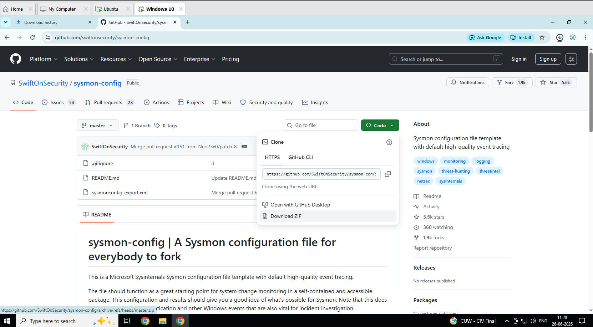
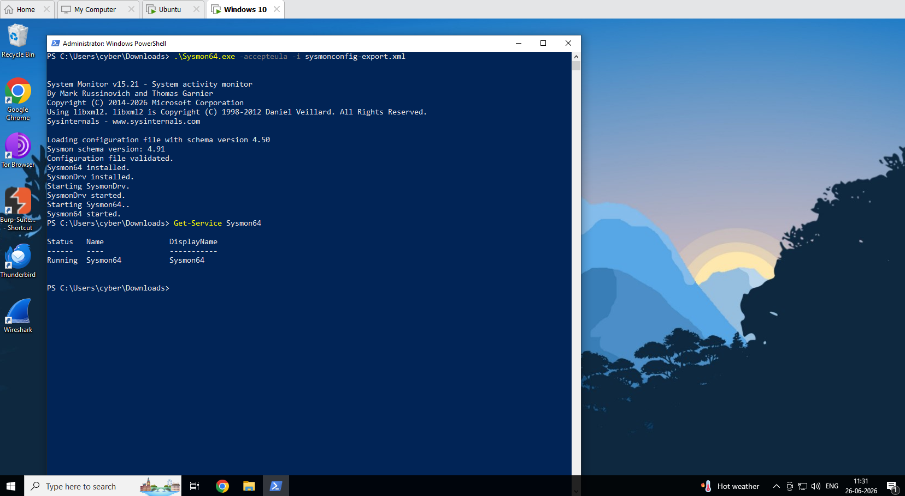

### Phase 2 — Attack Simulation
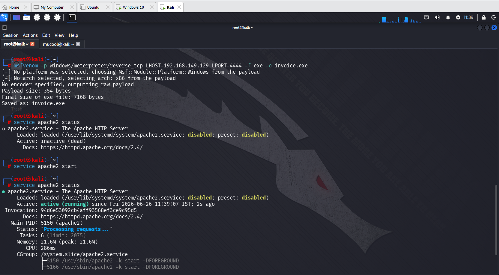
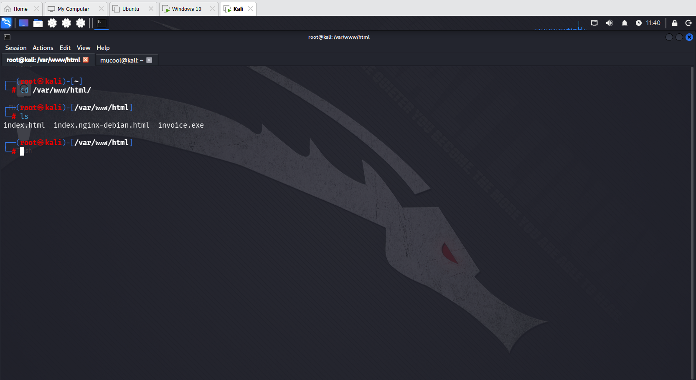
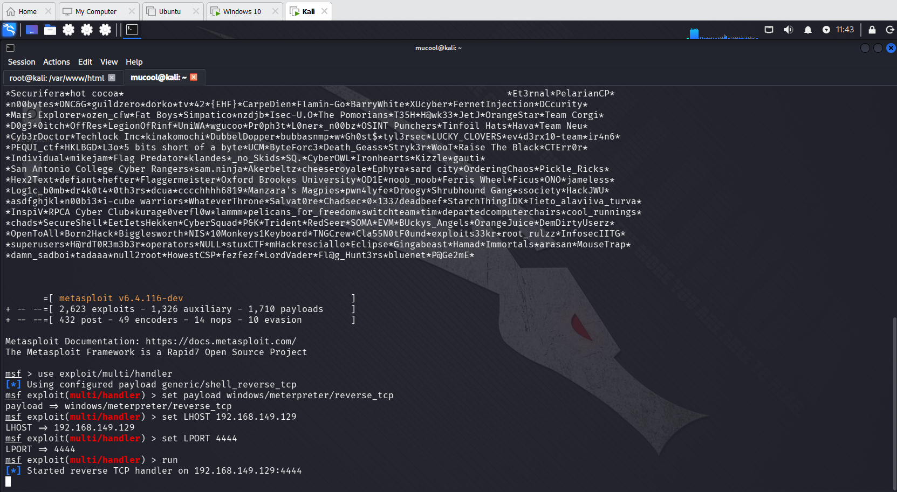
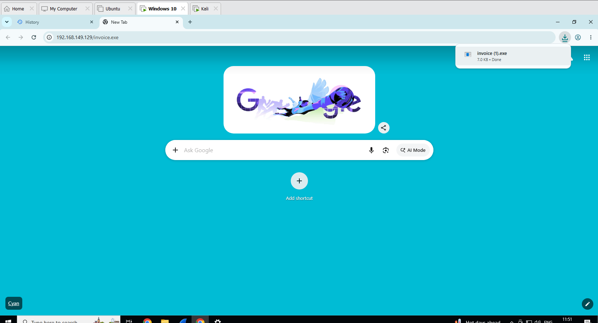
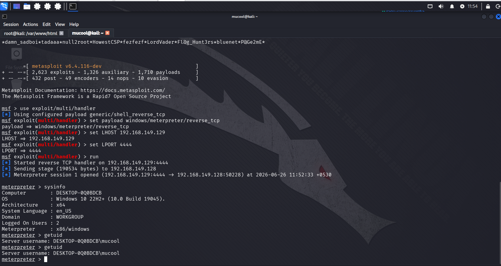

### Phase 3 — Detection & Log Collection
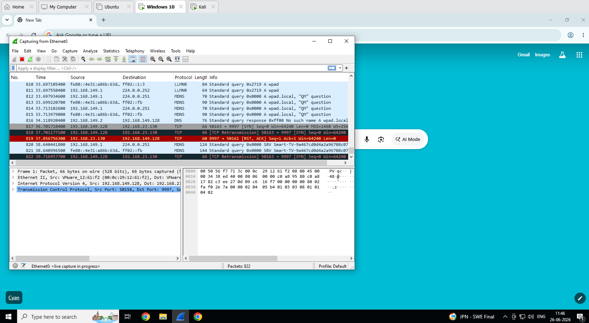
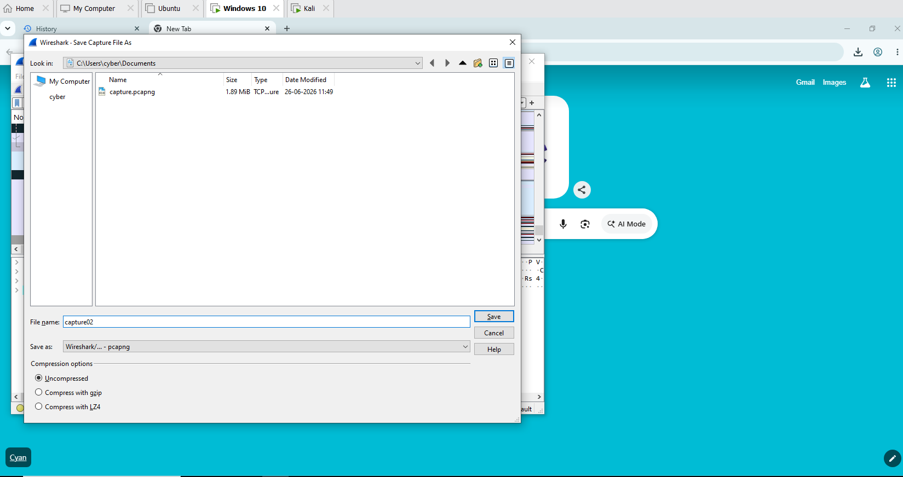
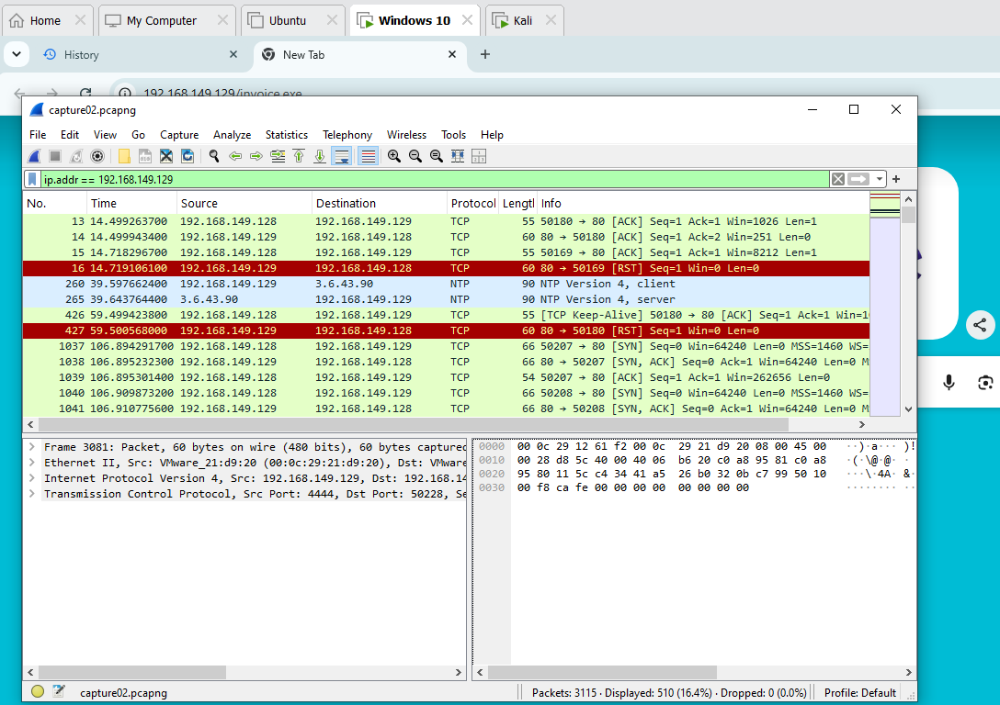
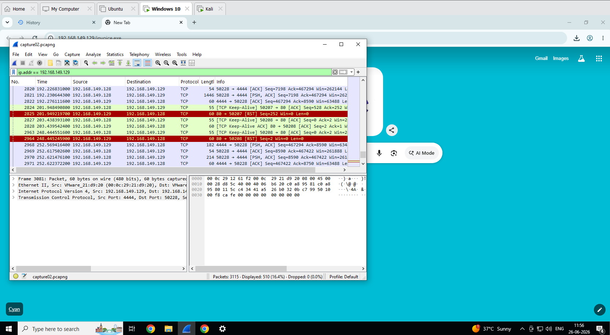
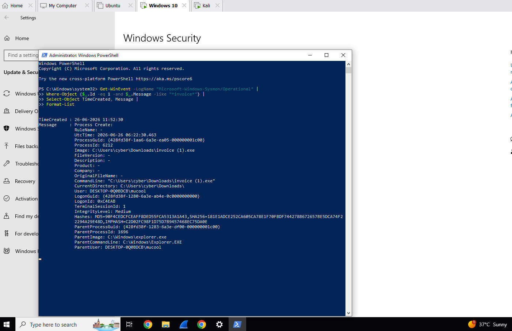
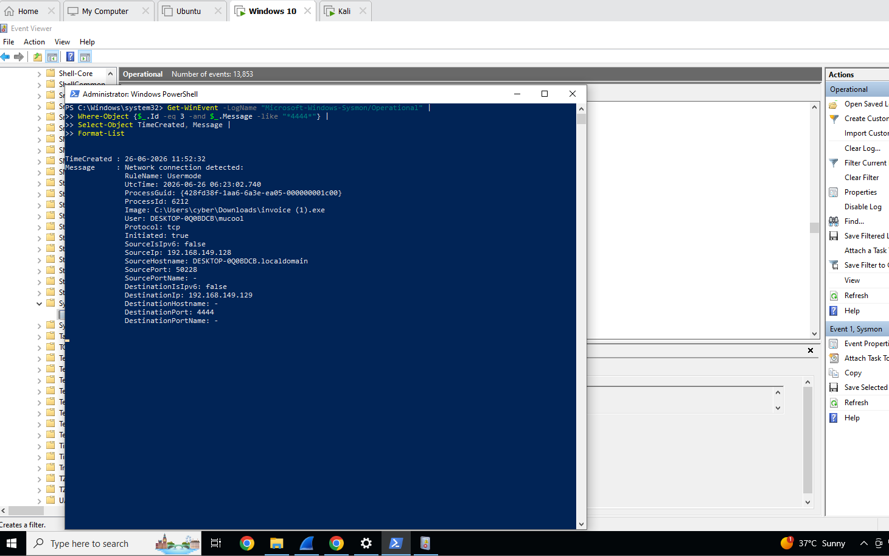

### Phase 4 — Triage
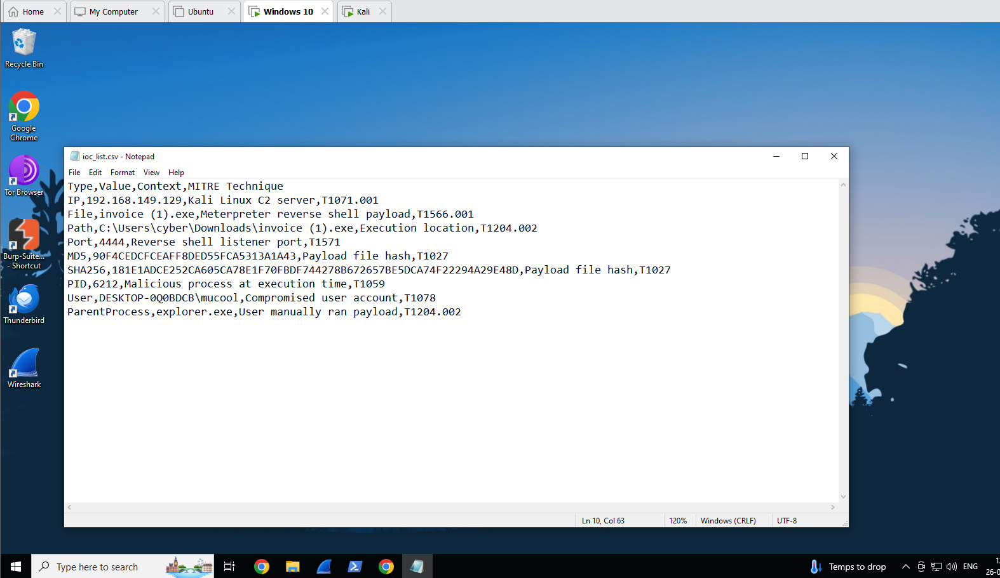

### Phase 5 — Containment
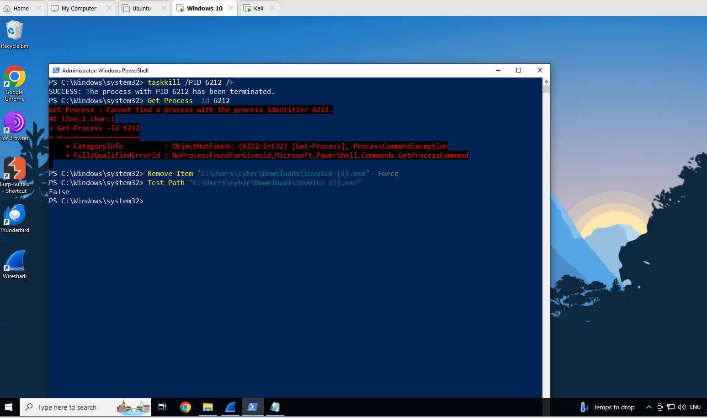
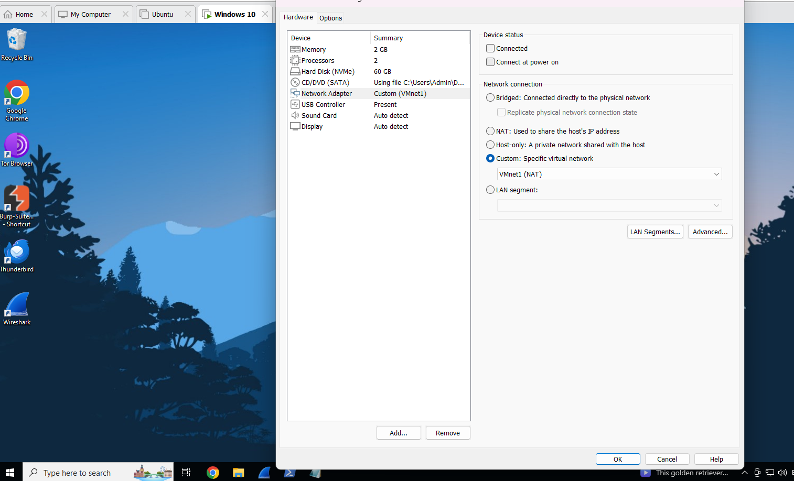

## References

- [MITRE ATT&CK Framework](https://attack.mitre.org)
- [SwiftOnSecurity Sysmon Config](https://github.com/SwiftOnSecurity/sysmon-config)
- [Sysinternals Sysmon](https://learn.microsoft.com/en-us/sysinternals/downloads/sysmon)
- [Metasploit Framework](https://www.metasploit.com)

---

*Project by Mukul Kumar | GitHub: [github.com/mukulkumar-labs](https://github.com/mukulkumar-labs)*
